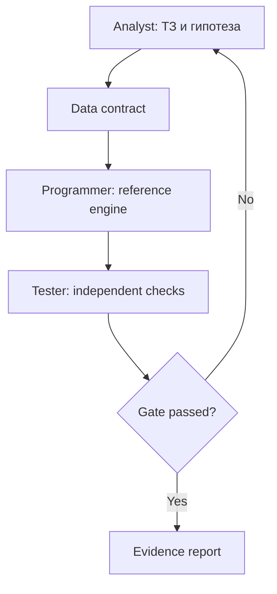
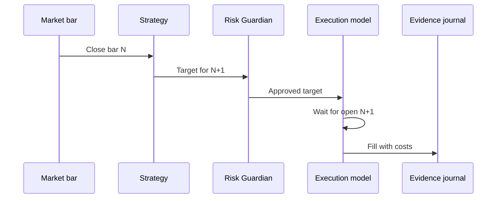
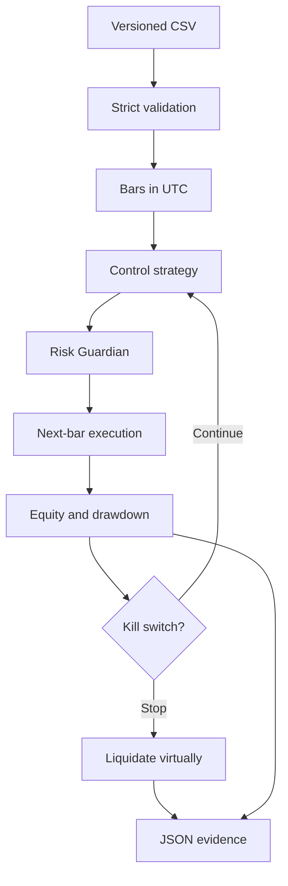

# Аналитические схемы M0

## Разделение ответственности

Аналитик не подтверждает собственный код. Программист не меняет критерии приёмки
после получения результата. Тестировщик проверяет не прибыль, а соответствие ТЗ,
причинность времени, риск и воспроизводимость.

## Временная причинность

Стратегия получает только историю до текущего закрытия. Цена открытия следующего
бара становится доступна лишь при исполнении и не участвует в формировании сигнала.

## Контур одного запуска

## Сравнение роботов

Все роботы используют один dataset, initial equity, cost model, risk policy и период.
Меняется только стратегия. Это позволяет отличить ценность сигнала от различий в
риске, комиссиях или доступных данных.
