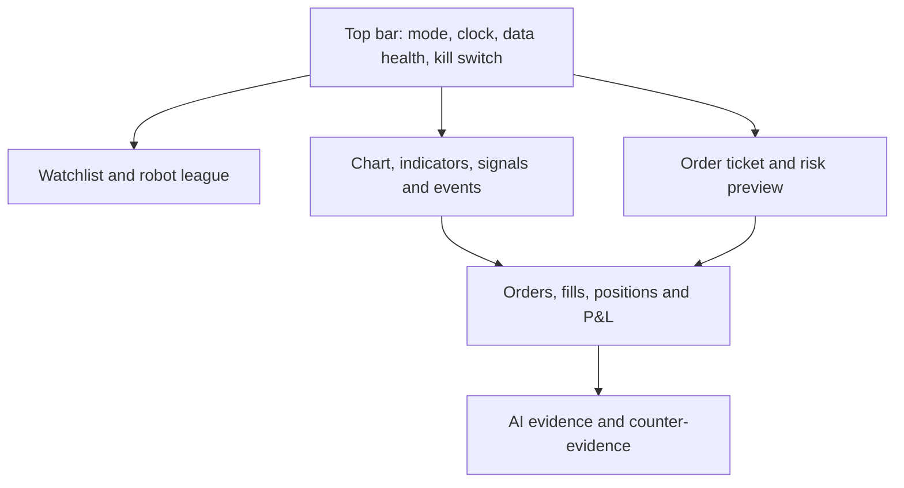

# ТЗ: FATHER Trading Console

## 1. Назначение

Создать профессионально выглядящий терминал для исследования, турниров роботов,
shadow-наблюдения и paper trading. Первый выпуск не подключает реальные средства.
Интерфейс показывает не только рынок и сделки, но и доказательства, зрелость, риск и
причины каждого решения.

## 2. Режимы

| Режим | Данные | Исполнение | Цветовой статус |
|---|---|---|---|
| REPLAY | Исторические | Виртуальное ускоренное | Синий |
| SHADOW | Текущие | Решения без заявок | Фиолетовый |
| PAPER | Текущие | Виртуальные заявки | Янтарный |
| LIVE | Не входит в утверждённый scope | Заблокировано | Красный замок |

Режим всегда виден в верхней панели. Переключение не может происходить скрыто или
по решению торгового/AI-робота.

## 3. Рабочее пространство

### Верхняя панель

- `REPLAY / SHADOW / PAPER / LIVE LOCKED`;
- биржевое время, локальное время и timezone;
- источник и задержка данных;
- состояние `Data Sentinel`, `Risk Guardian`, `Execution Simulator`;
- текущий drawdown и risk budget;
- отдельная кнопка `KILL SWITCH` с подтверждением остановки, но без возможности
  немедленного обратного включения.

### Watchlist и лига роботов

- инструмент, bid, ask, spread, last, change, volatility;
- robot ID, maturity, режим, позиция, P&L, drawdown и gate status;
- фильтры по стратегии, активу, режиму рынка и статусу;
- контрольные роботы всегда видимы рядом с кандидатами.

### Центральный график

- свечи и объём;
- bid/ask и spread;
- сигналы, виртуальные fills, stop и target;
- экономические, политические и погодные события;
- рыночный режим и зоны отсутствующих/сомнительных данных;
- несколько синхронизированных timeframe;
- replay с паузой и пошаговым переходом без доступа к будущему.

### Стакан и лента

- L1 в первом выпуске;
- L2 после появления проверенной модели order book;
- bids, asks, depth, spread и последние сделки;
- индикация stale data, gaps и потери последовательности сообщений;
- данные никогда не дорисовываются молча.

### Order ticket

Только виртуальные `market`, `limit`, `stop` и `stop-limit` после их реализации в
Execution Simulator. До отправки показываются:

- объём в units, валюте счёта и процентах баланса;
- ожидаемая цена, spread, комиссия и slippage range;
- stop-loss, take-profit и risk/reward;
- влияние на позицию, концентрацию и максимальный drawdown;
- предупреждения и блокирующие решения Risk Guardian;
- явная кнопка `SIMULATE`, а не `BUY/SELL` в REPLAY/SHADOW.

### Позиции, заявки и сделки

- открытые позиции;
- pending, filled, partially filled, cancelled и rejected заявки;
- realized/unrealized P&L;
- комиссии и стоимость исполнения;
- журнал ручного вмешательства;
- reconciliation между решением, заявкой, fill и позицией.

### AI Evidence Panel

Для каждого сигнала отображаются:

- robot ID и версия;
- исходная гипотеза;
- использованные данные и время их доступности;
- события и источники;
- уверенность и calibration bucket;
- контрдоказательства;
- результат агентов-критиков;
- maturity и пройденные gate;
- точная причина разрешения или блокировки действия.

Ответ LLM без evidence ID отображается как комментарий и не влияет на позицию.

## 4. Сервисы и API

| Сервис | Ответственность |
|---|---|
| Market Data API | Bars, quotes, trades, book snapshots, health и provenance |
| Strategy API | Decisions и explanations; без доступа к балансу и execution credentials |
| Risk API | Approve, resize, reject, halt и risk preview |
| Execution API | Виртуальные orders/fills и модель latency/cost |
| Portfolio API | Cash, positions, P&L, exposure и drawdown |
| Evidence API | Sources, hypotheses, tests, counter-evidence и maturity |
| Replay API | Исторические часы, pause, step и speed |

UI не пересчитывает финансовую истину самостоятельно: он отображает версионированное
состояние backend и отправляет команды через типизированные API.

## 5. Технологический маршрут

### Console MVP

- backend: Python/FastAPI после стабилизации доменного ядра;
- frontend: TypeScript/React;
- streaming: WebSocket;
- charts: библиотека выбирается отдельным ADR после прототипа;
- storage: PostgreSQL/Timescale-compatible schema или Parquet/DuckDB для replay;
- запуск: локально через Docker Compose;
- аутентификация: один локальный оператор без реальных брокерских credentials.

### Дальнейшее развитие

- настраиваемая mosaic-компоновка;
- multi-chart;
- L2/L3 order book;
- what-if portfolio;
- турнирная таблица и A/B-панель;
- мобильный read-only режим;
- экспорт доказательного отчёта.

## 6. UX безопасности

1. LIVE визуально и технически заблокирован.
2. One-click trading отсутствует.
3. Risk preview обязателен перед виртуальной ручной заявкой.
4. Предупреждение нельзя использовать вместо блокирующего risk gate.
5. Красный/зелёный цвет не является единственным носителем смысла.
6. При stale/unknown data новые действия блокируются.
7. После kill switch UI остаётся read-only до новой сессии и review.

## 7. Этапы готовности

| Этап | Результат |
|---|---|
| UI-L0 | Wireframe и типизированные mock data |
| UI-L1 | Replay sample, график, роботы и результаты без backend streaming |
| UI-L2 | API эталонного backtest engine и воспроизводимый отчёт |
| UI-L3 | WebSocket shadow stream, data health и event timeline |
| UI-L4 | Paper orders, positions, risk preview и kill switch |
| UI-L5 | Stress/recovery, reconciliation, audit и доступность |

## 8. Критерий приёмки MVP

- пользователь всегда понимает режим и источник данных;
- один и тот же run ID связывает график, fills, метрики и evidence;
- ни один UI-запрос не способен обойти Risk Guardian;
- replay не раскрывает будущие бары;
- virtual order lifecycle полностью наблюдаем;
- интерфейс работает при отсутствии AI;
- потеря потока переводит консоль в безопасное состояние.
